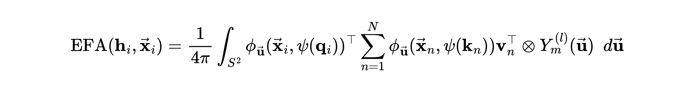

# torch-efa
PyTorch implementation of Euclidean Fast Attention (EFA) and Euclidean RoPE (ERoPE)

## Euclidean Fast Attention

[EFA](https://arxiv.org/abs/2412.08541) is an $O(3)$-equivariant, linear self-attention mechanism for 3D geometric data like molecules. Using kernelized attention, EFA can achieve all-to-all message passing. Euclidean Rotary Positional Encodings (ERoPE) is used to encode orientational information between pairs of nodes directly into the node features. EFA uses higher-order equivariant features from spherical harmonics, making it highly expressive. 



`torch-efa` is a fast and scalable PyTorch implementation of EFA and ERoPE for ML-based interatomic potentials or molecular systems.

## Installation

You can install `torch-efa` via `uv` and `pip`:

```bash
$ uv pip install torch-efa
```

You can also build the package from source:

```
bash
$ git clone https://github.com/rish-16/torch-efa.git
$ cd torch-efa
$ uv sync
```

## Usage

You can use the `EuclideanFastAttention` module like any other `torch.nn.Module` in place of existing equivariant modules:

```python
import torch
from torch_efa import EuclideanFastAttention

node_ftrs = torch.randn(B, N_atoms, parity, max_deg, dim)
pos = torch.randn(B, N_atoms, 3)

efa = EuclideanFastAttention(
    in_dim=o3.Irreps("..."), # input irreps
    out_dim=o3.Irreps("..."), # output irrep
    max_degree=3, # highest tensor degree
    num_lebedev=11, # number of grid points on sphere for Lebedev Quadrature 
)

y = efa(node_ftrs, pos) # [B, N_atoms, out_dim]
```

## Contributing

Appreciate any contributions in the form of PRs or Issues! 

## Citation

If `torch-efa` has been helpful in your work, please consider citing the repo!

```
@misc{anand2025torchefa,
  author       = {Rishabh Anand},
  title        = {torch-efa},
  year         = {2025},
  howpublished = {\url{https://github.com/rish-16/torch-efa}},
  publisher    = {GitHub}
}
```
